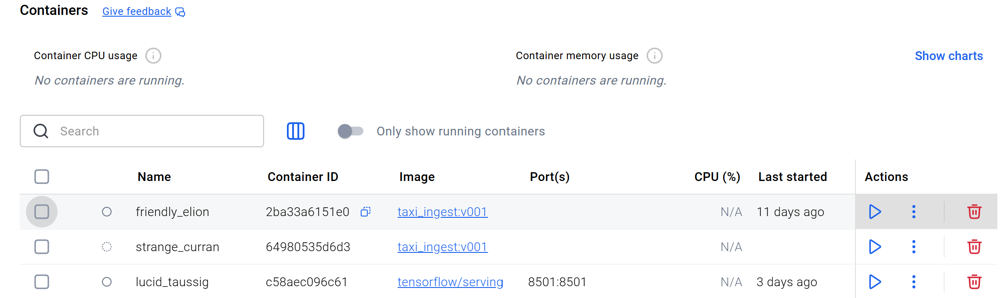
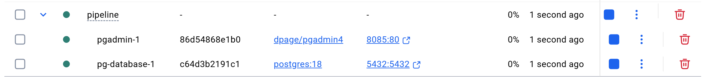
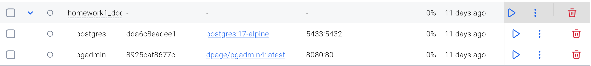
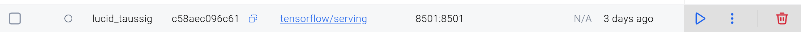
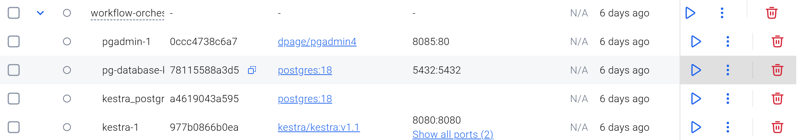

1.Image Name : taxi_ingest:v001
Container ID : 64980535d6d337633f8f312e62aaaac67f379c5121590f4755b7d180f631ae77
Name : strange_curran

Pre-requisite, ensure the postgres sql is up and running.
Mentioned in Step2

It will run the following command : python ingest_data.py with the following arguments: year(2021), month(1), pg_user(root),ps_password(root),pg_host(pg-database),pg-port(5432),pg-db(ny_taxi),target_table(yellow_taxi_data)

The containers will automatically exit upon successful execution in the front end.

2.Image Name : dpage/pgadmin4 port 8085:80   [Postgres SQL-admin pgadmin page]
  Image Name : postgres:18  port : 5432:5432 [Postgres sql via Terminal] docker exec -it pipeline-pg-database-1 psql -U root -d ny_taxi

Command Equivalent : 
docker run -it --rm \
  -e PGADMIN_DEFAULT_EMAIL="admin@admin.com" \
  -e PGADMIN_DEFAULT_PASSWORD="root" \
  -v pgadmin_data:/var/lib/pgadmin \
  -p 8085:80 \
  --network=pg-network \
  --name pgadmin \
  dpage/pgadmin4

docker run -it --rm \
  -e POSTGRES_USER="root" \
  -e POSTGRES_PASSWORD="root" \
  -e POSTGRES_DB="ny_taxi" \
  -v ny_taxi_postgres_data:/var/lib/postgresql \
  -p 5432:5432 \
  --network=pg-network \
  --name pg-database \
  postgres:18

Servers : pg-database
Database : ny_taxi , postgres
Tables : Belonging to the database ny_taxi 
Schemas : public 
Table Name : test , yellow_taxi_data

test - SQL : 
CREATE TABLE test (id INTEGER, name VARCHAR(50));
INSERT INTO test VALUES (1, 'Hello Docker');
SELECT * FROM test;

yellow_taxi_data
Ingested via the execution of taxi_ingest:v001

3.

Image Name : dpage/pgadmin4:latest port 8080:80   [Postgres SQL-admin pgadmin page]
Image Name : postgres:17-alpine  port : 5433:5432 [Postgres sql via Terminal]

docker exec -it dda6c8eadee10d11b23f2363411810dd2e7e5f556b636fa4a2ec8ea453bc813c psql -U postgres -d ny_taxi

Command Equivalent : 
docker run -it --rm \
  -e PGADMIN_DEFAULT_EMAIL="pgadmin@pgadmin.com" \
  -e PGADMIN_DEFAULT_PASSWORD="pgadmin" \
  -v vol-pgadmin_data:/var/lib/pgadmin \
  -p 8080:80 \
  --name pgadmin \
  dpage/pgadmin4

docker run -it --rm \
  -e POSTGRES_USER="postgres" \
  -e POSTGRES_PASSWORD="postgres" \
  -e POSTGRES_DB="ny_taxi" \
  -v vol-pgdata:/var/lib/postgresql/data \
  -p 5433:5432 \
  --name db \
postgres:17-alpine

Servers : db(homework)
Database : ny_taxi , postgres
Tables : Belonging to the database ny_taxi 
Schemas : public 
Table Name : green_trip_data, taxi_zone_data(ingested from taxi_zone_lookup.csv)

4.

Related to ML Model Deployment / Model Serving (Tensor Flow)

5.

Related to Kestra Orchestration

Example output:
| CONTAINER ID   | IMAGE                | STATUS          | PORTS                     | NAMES                                   |
|----------------|----------------------|-----------------|---------------------------|-----------------------------------------|
| e77595234376   | kestra/kestra:v1.1   | Up 5 minutes    | 8080-8081/tcp             | workflow-orchestration-kestra-1         |
| 41f05dacb410   | postgres:18          | Up 5 minutes    | 5432/tcp                  | workflow-orchestration-kestra_postgres-1|
| 4755ab9c0911   | dpage/pgadmin4       | Up 5 minutes    | 8085/tcp                  | workflow-orchestration-pgadmin-1        |
| 2a4579040b82   | postgres:18          | Up 5 minutes    | 5432/tcp                  | workflow-orchestration-pg-database-kestra-1 |

### 3. Access the UI
- **pgAdmin4**: [http://127.0.0.1:8085/browser/](http://127.0.0.1:8085/browser/)  
- **Kestra UI**: [http://127.0.0.1:8080/ui/login?from=/dashboards](http://127.0.0.1:8080/ui/login?from=/dashboards)

## Summary of Containers

| Container ID   | Image                | Description                                      |
|----------------|----------------------|--------------------------------------------------|
| `4755ab9c0911` | `dpage/pgadmin4`     | pgAdmin container (Access pgAdmin UI)           |
| `2a4579040b82` | `postgres:18`        | PostgreSQL database container                   |
| `41f05dacb410` | `postgres:18`        | Kestra metadata database container              |
| `e77595234376` | `kestra/kestra:v1.1` | Kestra server container (Access Kestra UI)      |

Servers : kestra_postgres, pg-database-kestra
Database : kestra,postgres for server : kestra_postgres
Tables : Belonging to the database kestra , schema : public
All kestra metadata related tables

Database : ny_taxi , postgres for Server : pg-database-kestra
Tables : Belonging to the database ny_taxi , schema : public
green_tripdata,green_tripdata_staging
yellow_tripdata,yellow_tripdata_staging

green_tripdata contains files ingested from 2020-01 to 2020-12
yellow_tripdata contains files ingested from 2020-01 to 2020-12
yellow_tripdata also contains files ingested for : 2019-01
yellow_tripdata also contains files ingested for : 2021-03

Sample SQL :
SELECT * FROM public.yellow_tripdata;

SELECT filename,count(*) from public.yellow_tripdata
group by filename;

SELECT SUM(count)
FROM (SELECT filename,count(*) as count from public.yellow_tripdata group by filename) 
WHERE filename LIKE 'yellow_tripdata_2020-%';

SELECT filename,count(*) from public.green_tripdata
group by filename;

SELECT SUM(count)
FROM (SELECT filename,count(*) as count from public.green_tripdata group by filename) 
WHERE filename LIKE 'green_tripdata_2020-%';

